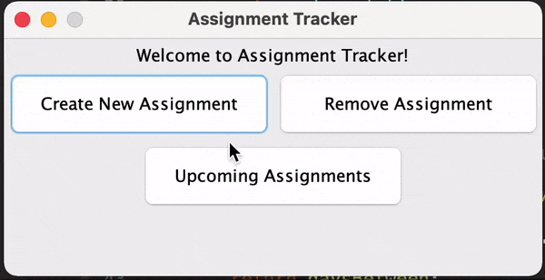
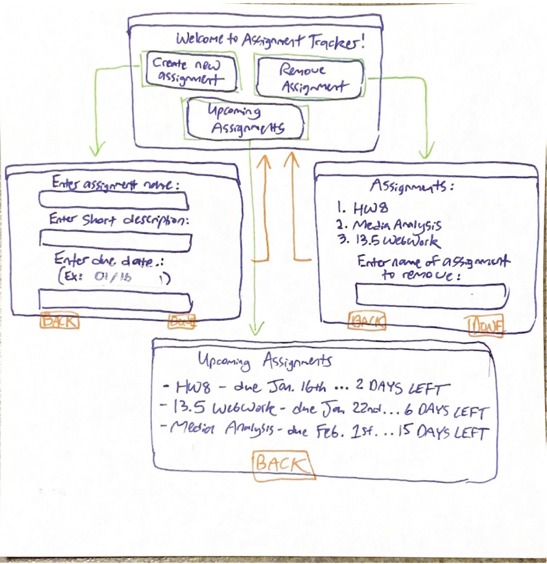

# assignment-tracker
Create and remove assignments, then view them in upcoming order! Get information on the days until each assignment is due according to the current date.

## General Information
- Honors Contract project for CSE 110 - Fall 2021
- Incorporates past unit materials such as custom objects, multiple classes, ArrayLists, and sorting
- GUI built using Java Swing

## Features
- "Create New Assignment," "Remove Assignment," and "Upcoming Assignments" panels built and designed using Java Swing
- Add assignments by name, description, and due date
- Remove assignments by name
- View upcoming assignments sorted by date as well as the days until due (according to the current date)

## Content

Project Storyboard

## License
This project is open source and available under the MIT License.

